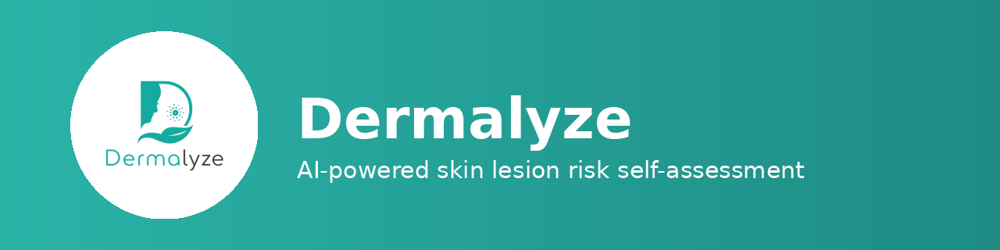
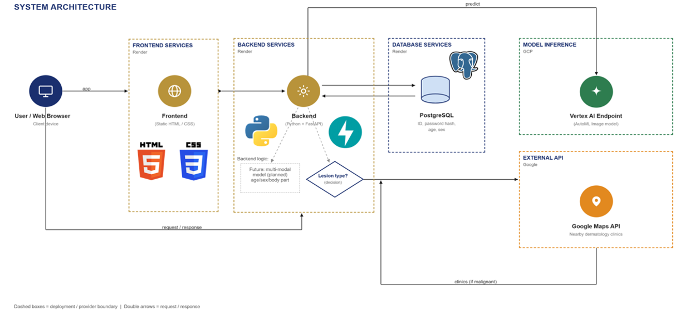

<div align="center">
  

  
  
  
  
  
  

  <p>
    <a href="#key-features">Features</a> •
    <a href="#how-it-works">How It Works</a> •
    <a href="#tech-stack">Tech Stack</a> •
    <a href="#live-demo">Live Demo</a> •
    <a href="#team">Team</a>
  </p>
</div>

<br>

## About

> Your skin, decoded by AI.

Dermalyze is a B2C self-assessment service that turns a single photo into a clear skin lesion risk read — powered by a Vertex AI AutoML model.

## Demo

> ✨ Deployment link & screenshots coming soon — stay tuned.

<br>

## Key Features

<table>
  <tr>
    <td width="33%" valign="top">
      <h3>🔍 Instant Analysis</h3>
      <p>Upload a lesion photo and get an AI-driven risk prediction in seconds.</p>
    </td>
    <td width="33%" valign="top">
      <h3>🏥 Smart Booking</h3>
      <p>High Risk results automatically surface nearby clinics for booking.</p>
    </td>
    <td width="33%" valign="top">
      <h3>📋 Clinical Reports</h3>
      <p>EHR-style PDF reports, ready to share with your doctor.</p>
    </td>
  </tr>
</table>

<br>

## How It Works

| Step | Action |
|:---:|---|
| 1️⃣ | **Upload** a photo of a skin lesion |
| 2️⃣ | **Analyze** — our AI evaluates the risk level |
| 3️⃣ | **Review** the result (Low / High) |
| 4️⃣ | **Act** — High Risk results connect you directly to a nearby clinic |

<br>

## Tech Stack

| Area | Technology |
|:---|:---|
| 🤖 ML | Vertex AI AutoML |
| ⚙️ Backend | FastAPI, Render |
| 🎨 Frontend | HTML, CSS, JavaScript |
| ☁️ Infra | GCP, PostgreSQL |

<br>

## System Architecture

<div align="center">
  
</div>

| Layer | Service | Role |
|:---|:---|:---|
| Frontend | Static HTML / CSS (Render) | User-facing web app |
| Backend | Python + FastAPI (Render) | API logic, lesion type routing |
| Database | PostgreSQL (Render) | User ID, password hash, age, sex |
| Model Inference | Vertex AI Endpoint (GCP) | AutoML image model prediction |
| External API | Google Maps API | Nearby dermatology clinic search |

<sub>Dashed boxes = deployment / provider boundary · Double arrows = request / response</sub>

<br>

## Folder Structure

```
Dermalyze/
├── backend/
│   ├── app/
│   │   ├── api/          # routes
│   │   ├── core/         # config.py, database.py, security.py
│   │   ├── models/       # user.py
│   │   ├── schemas/      # auth.py, gemini_report.py, hospitals.py, lesion.py
│   │   ├── services/     # gemini_report.py, image.py, places.py, vertex_predictor.py
│   │   └── main.py
│   ├── tests/
│   ├── render.yaml
│   └── requirements.txt
├── frontend/
│   ├── assets/
│   ├── css/
│   ├── js/
│   └── # index.html, signup.html, upload.html, body-part.html, dashboard.html, results.html, hospitals.html, support.html
├── PRD.md
├── README.md
└── TEAM.md
```

<br>

## Live Demo

🔗 Frontend: **[dermalyze-frontend.onrender.com](https://dermalyze-frontend.onrender.com/)**

<br>

## Team

See [TEAM.md](./TEAM.md) for team details.

---

<div align="center">
  <sub>Built by our team, one commit at a time 💙 Questions, ideas, or bugs? Open an issue — we'd love to hear from you.</sub>
</div>
