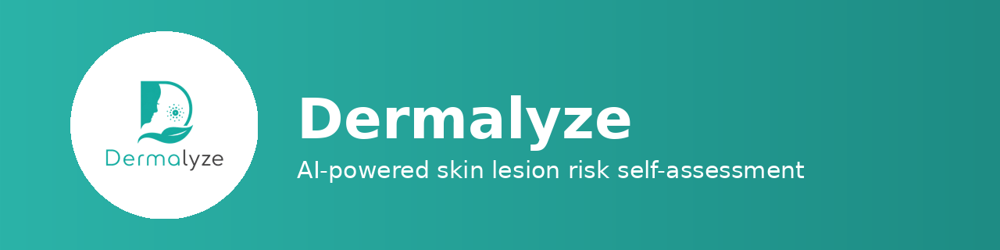
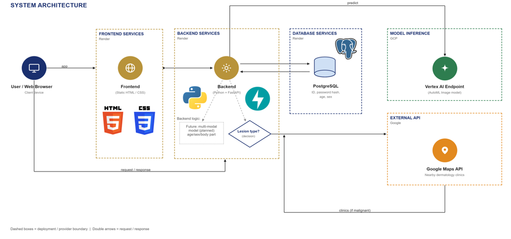

<div align="center">
  

  
  
  
  
  
  

  <p>
    <a href="#problem-statement">Problem</a> •
    <a href="#solution-overview">Solution</a> •
    <a href="#key-features">Features</a> •
    <a href="#tech-stack">Tech Stack</a> •
    <a href="#target-users">Target Users</a> •
    <a href="#project-files">Project Files</a> •
    <a href="#live-demo">Live Demo</a> •
    <a href="#team">Team</a> •
    <a href="./PRD.md">PRD</a>
  </p>
</div>

<br>

## About

> Your skin, decoded by AI.

Dermalyze is a B2C self-assessment service that turns a single photo into a clear skin lesion risk read — powered by a scikit-learn model trained on the HAM10000 dataset and shipped with the backend as a `.pkl` file (no cloud ML endpoint or GCP billing required).

> 📄 Looking for product requirements and specs? See [PRD.md](./PRD.md).

### Submission Requirements Checklist

| Devpost requirement | Covered in this README |
|:---|:---|
| Project Title | **Dermalyze** (see badge/header above) |
| Problem Statement | [Problem Statement](#problem-statement) |
| Solution Overview | [Solution Overview](#solution-overview) |
| Key Features | [Key Features](#key-features) |
| Technologies Used | [Tech Stack](#tech-stack) |
| Target Users | [Target Users](#target-users) |
| Project Files (screenshots / video) | [Project Files](#project-files) |
| Project Link / Repository | This repository + [Live Demo](#live-demo) |
| Team Details | [Team](#team) |

<br>

## Problem Statement

When someone notices a new or changing skin lesion (mole, spot, etc.), they usually have no reliable way to judge whether it's dangerous — so most people either ignore it or make an unnecessary, costly clinic visit "just in case."

This gap exists because of:
1. **Lack of accessible expert knowledge** — most people can't tell a benign mole from an early-stage malignancy by eye.
2. **Barriers to visiting a clinic** — cost and time keep people from getting a professional opinion for something that "might be nothing."
3. **Existing self-check apps stop short** — they output a bare risk score with no guidance on what to actually do next.

## Solution Overview

**Team D – Dermalyze** *(AI service platform)*

**Subtitle:** Skin Condition & Severity Analysis

Dermalyze is an AI service platform that helps identify potential skin conditions and assess their severity. Users simply take a photo of the affected area and upload it through the application. The platform then predicts the most likely skin condition along with an estimated severity class, and branches the user toward a concrete next action — self-care guidance for low-risk results, or a nearby clinic connection for high-risk results. This allows users to perform an initial self-assessment and better understand whether their symptoms require medical attention, supporting more informed healthcare decisions and encouraging appropriate clinical visits when necessary.

## Demo

🎬 Watch the demo video: **[youtu.be/S3S7a9rGxTg](https://youtu.be/S3S7a9rGxTg)**

<br>

## Key Features

<table>
  <tr>
    <td width="33%" valign="top">
      <h3>🔍 Instant Analysis</h3>
      <p>Upload a lesion photo and get an AI-driven risk prediction in seconds.</p>
    </td>
    <td width="33%" valign="top">
      <h3>🏥 Smart Booking</h3>
      <p>High Risk results automatically surface nearby clinics for booking.</p>
    </td>
    <td width="33%" valign="top">
      <h3>📋 Clinical Reports</h3>
      <p>EHR-style PDF reports, ready to share with your doctor.</p>
    </td>
  </tr>
</table>

<br>

## Target Users

| Persona | Description |
|:---|:---|
| **Primary** — Everyday adults (20s–40s) | Notice a skin abnormality but hesitate to visit a clinic; want a quick, jargon-free "is this serious?" answer before deciding whether to book an appointment |
| **Secondary** — Older adults (60s–70s) | Higher-risk group for malignant/precancerous lesions (melanoma, basal cell carcinoma); benefit most from early, low-friction screening |
| **Not the current target** | Patients already under regular dermatology follow-up who need clinical-grade longitudinal tracking — that's a professional-medical-workflow use case, out of scope for now |

<br>

## How It Works

| Step | Action |
|:---:|---|
| 1️⃣ | **Upload** a photo of a skin lesion |
| 2️⃣ | **Analyze** — our AI evaluates the risk level |
| 3️⃣ | **Review** the result (Low / High) |
| 4️⃣ | **Act** — High Risk results connect you directly to a nearby clinic |

<br>

## Tech Stack

| Area | Technology |
|:---|:---|
| 🤖 ML | scikit-learn RandomForest, trained locally, loaded from a committed `.pkl` |
| ⚙️ Backend | FastAPI, Render |
| 🎨 Frontend | HTML, CSS, JavaScript |
| ☁️ Infra | PostgreSQL |

<br>

## Project Files

Files demonstrating functionality and design, per the submission requirements:

| File | Description |
|:---|:---|
| 🎬 [Demo video](https://youtu.be/S3S7a9rGxTg) | End-to-end walkthrough of the app |
| 🖼️ [assets/banner.png](./assets/banner.png) | Product banner / branding |
| 🗺️ [assets/architecture.png](./assets/architecture.png) | System architecture diagram |
| 📸 [assets/team-photo.jpg](./assets/team-photo.jpg) | Team photo |
| 🔗 [Live Demo](#live-demo) | Deployed, working application |

<br>

## System Architecture

<div align="center">
  
</div>

<sub>⚠️ Diagram predates the move off Vertex AI — model inference is now local, not a GCP endpoint (see table below).</sub>

| Layer | Service | Role |
|:---|:---|:---|
| Frontend | Static HTML / CSS (Render) | User-facing web app |
| Backend | Python + FastAPI (Render) | API logic, lesion type routing |
| Database | PostgreSQL (Render) | User ID, password hash, age, sex |
| Model Inference | Local scikit-learn model (`backend/app/ml_models/skin_lesion_model.pkl`) | Image classification prediction, runs in-process |
| External API | OpenStreetMap Overpass API | Nearby dermatology clinic search |

<sub>Dashed boxes = deployment / provider boundary · Double arrows = request / response</sub>

<br>

## Folder Structure

```
Dermalyze/
├── backend/
│   ├── app/
│   │   ├── api/          # routes
│   │   ├── core/         # config.py, database.py, security.py
│   │   ├── models/       # user.py
│   │   ├── schemas/      # auth.py, gemini_report.py, hospitals.py, lesion.py
│   │   ├── services/     # gemini_report.py, image.py, places.py, local_predictor.py
│   │   ├── ml/           # features.py — feature extraction shared by training + inference
│   │   ├── ml_models/    # skin_lesion_model.pkl — committed, trained model artifact
│   │   └── main.py
│   ├── scripts/
│   │   └── train_model.py  # retrain the .pkl from the HAM10000 dataset
│   ├── tests/
│   ├── render.yaml
│   └── requirements.txt
├── frontend/
│   ├── assets/
│   ├── css/
│   ├── js/
│   └── # index.html, signup.html, upload.html, body-part.html, dashboard.html, results.html, hospitals.html, support.html
├── PRD.md
├── README.md
└── TEAM.md
```

<br>

## Live Demo

🔗 Frontend: **[dermalyze-frontend.onrender.com](https://dermalyze-frontend.onrender.com/)**

<br>

## Team

| Name | Role |
|:---|:---|
| 🐼 Yeonwoo Noh | Team Leader |
| 🐱 Junyup Lee | Tech Leader |
| 🦊 Cheoljun Yu | Backend |
| 🐹 Chaeryoung Hong | Frontend |
| 🐢 Jiwon Kim | Frontend, Backend |

See [TEAM.md](./TEAM.md) for full team details.

For product requirements, scope, and specs, see [PRD.md](./PRD.md).

---

<div align="center">
  <sub>Built by our team, one commit at a time 💙 Questions, ideas, or bugs? Open an issue — we'd love to hear from you.</sub>
</div>
